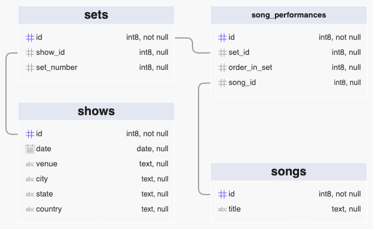

# Grateful Docker

This project defines a Docker container containg a postgres database that is
populated with data describing every show that the Grateful Dead performed.

The data in the container was sourced from 
[github.com/jefmsmit/gdshowsdb](https://github.com/jefmsmit/gdshowsdb).
If you are interested in the data but are not interested in the Docker
container defined by this project, please review the `yaml` representation
of the data in `gdshowsdb` and please review the `sql` representation of the
data in the `sql/data.sql` in this project.

## Run The Docker Container

When running the container you must provide environment variable values for
the default postgres user password (`POSTGRES_PASSWORD`) and the name of the
database that will bec reated in the container (`POSTGRES_DB`).

### Create A Named Container

```bash
docker create --name gratefuldatacontainer -e POSTGRES_PASSWORD=mysecretpassword -e POSTGRES_DB=thegratefuldata -p 5432:5432 jeffscottbrown/gratefulpostgres:0.2.0
```

### Start The Container

```bash
docker start gratefuldatacontainer
```

### Stop The Container

```bash
docker stop gratefuldatacontainer
```

While the container is running postgres is running and listening
on port 5432.

### Database Schema

The following diagram illustrates the schema of the database:


